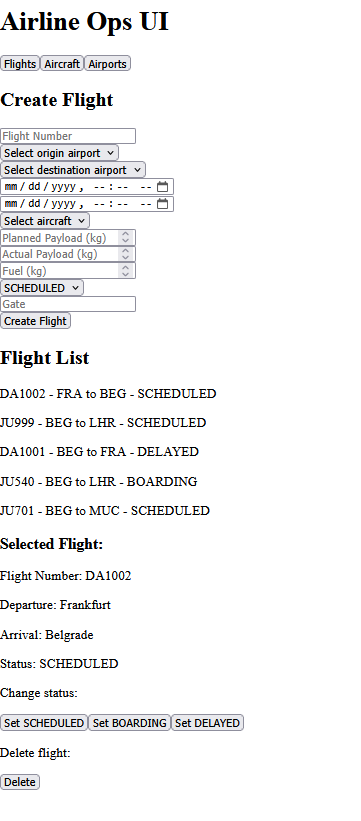
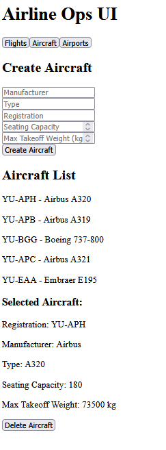
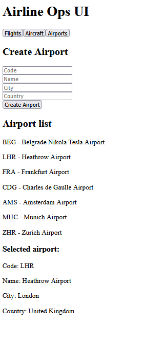

# Airline Ops UI

A minimal React frontend used to interact with the **Airline Operations API** backend.

---

## Tech Stack

* React
* Vite
* JavaScript (ES6)
* Fetch API
* Basic HTTP Authentication

---

## Features

The UI allows basic interaction with the backend API:

### Flights

* View flights
* Create new flights
* Update flight status
* Delete flights

### Aircraft

* View aircraft
* Create aircraft
* Delete aircraft

### Airports

* View airports
* Create airports

---

## Authentication

The backend API is secured with **HTTP Basic Authentication**.

Demo credentials used in the UI:

```
admin / admin123
```

A simple login screen will be added later.
Currently the credentials are used directly for API requests.

---

## Screenshots

### Flights



### Aircraft



### Airports



---

## Backend

This UI is designed to work with the **Airline Operations API** backend built with:

* Java
* Spring Boot
* Spring Data JPA
* PostgreSQL
* Flyway
* Spring Security

The backend repository contains the main business logic and domain model.

---

## Purpose of this project

The goal of this UI is to provide a simple interface for interacting with the Airline Operations API while learning React basics.

The primary focus of the project is the **backend system and API design**, while the frontend is intentionally kept minimal.

---

